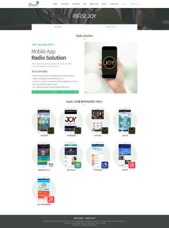
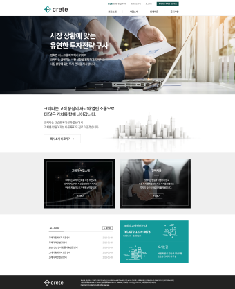
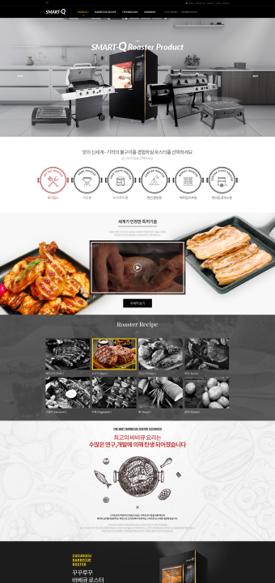
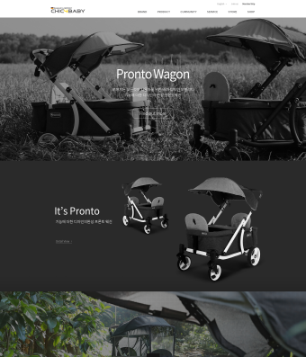
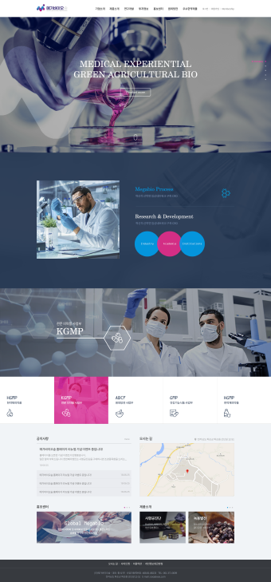
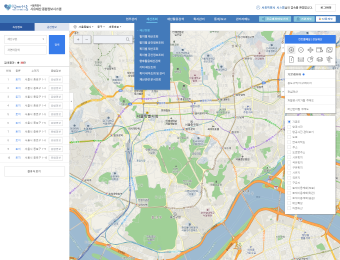
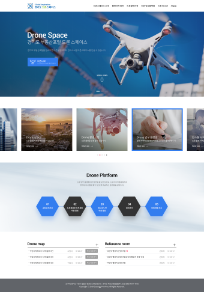

# [publisher] portfolio 2018

##### ALL  https://github.com/ara-pf/portfolio     
##### 2020 https://github.com/ara-pf/portfolio/blob/master/2020.md     
##### 2019 https://github.com/ara-pf/portfolio/blob/master/2019.md     
##### 2018 https://github.com/ara-pf/portfolio/blob/master/2018.md     
##### 2017 https://github.com/ara-pf/portfolio/blob/master/2017.md     
##### 2016 https://github.com/ara-pf/portfolio/blob/master/2016.md     
　   
　   
　   
2018
------
2018.01
#### - 스키폴리 http://www.skipoli.co.kr
#### - 창조이엔지 http://www.changjoeng.co.kr
#### - 지로드코리아  

#### - 크레타  

   
　      
2018.02
#### - 머니홀릭 http://mholic.co.kr
#### - 안산튼튼병원(MOBILE)  

    
　      
2018.03
#### - CTS지사 3type      
  대구 http://daegu.cts.tv  
  부산 http://busan.cts.tv  
  대전 http://daejeon.cts.tv  
  전북 http://jeonbuk.cts.tv  
  전남 http://jeonnam.cts.tv  
  포항 http://pohang.cts.tv  
  울산 http://ulsan.cts.tv  
  영서 http://yeongseo.cts.tv    
  경남 http://gn.cts.tv  
  충북 http://chungbuk.cts.tv
#### - SDS  

#### - 도쿄술집 / 메인 리뉴얼 http://tokyosuljip.com
　      
2018.04
#### - 클럽비발디 수상레저 http://www.clubvivaldi.com
　      
2018.05
#### - 꾸꾸루꾸 스마트큐  

　      
2018.06
#### - 닉스 http://www.nicksgo.com
#### - 마트킹 http://www.martking.co.kr
#### - 구이가 / 메인리뉴얼 http://92ga.co.kr
　      
2018.07
#### - 시크포베이비  

　      
2018.08
#### - 메가바이오  

#### - 서울부동산정보광장 / 메인 http://land.seoul.go.kr
　      
2018.09
#### - 서울시유재산 종합정보시스템  

　      
2018.10
#### - 경기도 드론스페이스  

#### - 서울부동산시장동향 분석시스템
　      
2018.11
#### - Nbot - NICKS service  

    
　      
2018.12
#### - 더런드리 http://www.thelaundry.co.kr
　      
　   
